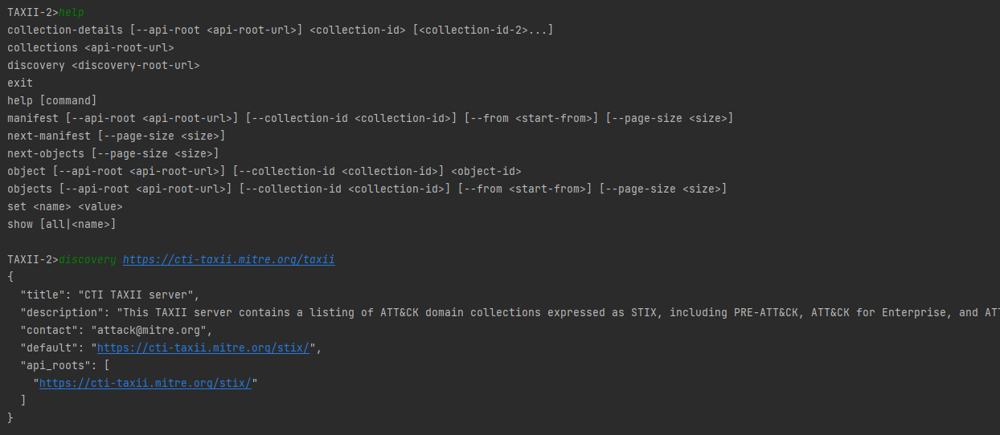

# taxii2lib
TAXII 2.0 library and tool to browse STIX (Structured Threat Information Expression) data objects

This project gives an access point to use STIX data. This provides a command line tool as well as a Java library.
Any _user_, like an analyst, can directly use the tool to browse through security data.
A _developer_ who wants to integrate STIX data into their application can use this as library _jar_.

###STIX Standards

> Structured Threat Information Expression (STIX™) is a language and serialization format used to exchange cyber threat intelligence (CTI). STIX is open source and free allowing those interested to contribute and ask questions freely.

Standards can be referred at https://oasis-open.github.io/cti-documentation/stix/intro

<sub><sup>Fig: STIX 2 Relationship Example</sup></sub>
## For Tool Users
This is a java based tool, and it works only on systems where java has been installed
**Requirement: Java 8 or above**

Download the jar from releases and copy it on to your local machine where Java has been installed.  
To invoke the tool, run below command to form the same directory where the jar file has copied to
```
java -jar seshut-taxii2lib-0.1.jar
```
You would see below prompt once it launches successfully
```
TAXII-2>
```
Below is the list of commands that it provides:
```
TAXII-2>help
collection-details [--api-root <api-root-url>] <collection-id> [<collection-id-2>...]
collections <api-root-url>
discovery <discovery-root-url>
exit
help [command]
manifest [--api-root <api-root-url>] [--collection-id <collection-id>] [--from <start-from>] [--page-size <size>]
next-manifest [--page-size <size>]
next-objects [--page-size <size>]
object [--api-root <api-root-url>] [--collection-id <collection-id>] <object-id>
objects [--api-root <api-root-url>] [--collection-id <collection-id>] [--from <start-from>] [--page-size <size>]
set <name> <value>
show [all|<name>]
```
Just use those commands and start browsing through STIX data

### Sample Screens


## For developers
Developers can download the jar from release and add to their application.

The main access point to this library is **TaxiiLib** class. Create an instance of this class and use its methods.

Below is a sample code snippet
```java
TaxiiLib taxiiLib = new TaxiiLib();
taxiiLib.setBasicAuthorization("guest", "guest");
StixDiscovery discoveryObject = taxiiLib.getDiscoveryAsObject("https://cti-taxii.mitre.org/taxii");
```
It provides two variety of methods to access data. One set of methods gives raw JSON data, while others give Java POJO objects.

Following methods are available to access STIX Data
```java
//To do discovery using API Root
StixDiscovery discoveryObject = taxiiLib.getDiscoveryAsObject("https://cti-taxii.mitre.org/taxii");

//To get collection list
List<StixCollection> collections = taxiiLib.getCollectionsAsObject("https://cti-taxii.mitre.org/stix/");

//To get one collection details
StixCollection collection = taxiiLib.getCollectionDetailsAsObject("https://cti-taxii.mitre.org/stix/", "2f669986-b40b-4423-b720-4396ca6a462b");

//To get one page of STIX Objects
StixObjectResult objects = taxiiLib.getObjectsAsObjects("https://cti-taxii.mitre.org/stix/", "2f669986-b40b-4423-b720-4396ca6a462b");
//To get nex page of objects
objects = getNextObjectsAsObject();

//To get specific object details
StixObjectResult objects = taxiiLib.getObjectByIdAsObject("https://limo.anomali.com/api/v1/taxii2/feeds",
		"68", "relationship--21842707-0f15-43bf-bc42-2bceadf2cfa2");

//To get the manifest list
StixManifestResult manifest = taxiiLib.getManifestAsObject("https://limo.anomali.com/api/v1/taxii2/feeds/", "68", -1, -1);
//To get next page of manifest
manifest = taxiiLib.getNextManifestAsObject();

//To set page size
taxiiLib.setPageSize(100);

//To set basic authentication
taxiiLib.setBasicAuthorization("guest", "guest");

```
All above methods have alternative methods to get data as raw JSON String, just remove _AsObject_ in the method name. 

You can also look at this class [SampleUsage](src/test/java/com/seshutechie/taxii2lib/test/SomeDirtyTest.java) for sample usage.

## Upcoming features
- Filter options to get only certain data
- On tool, save objects to file
